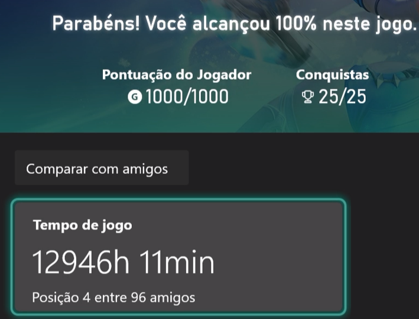

# Portfólio Individual - Quinzena 02
## Por Dentro dos LLMs: A Metacognição da Alucinação (Módulo 5 / Módulo 6)

* **Nome do Aluno:** Lucas da Silva Ferreira
* **Caso Recebido:** Caso A
* **Disciplina:** COM170 - Inteligência Artificial na Prática Acadêmica e Profissional
* **Instituição:** UNIVESP

---

### 📋 Guia de Referência: Os Cinco Tipos de Alucinação

| Tipo | Comportamento Humano (*Análogo*) | Como Reconhecer |
| :--- | :--- | :--- |
| **Alucinação factual** | *O blefe* | Uma afirmação falsa com estrutura correta. Um dado, um nome, um número ou uma referência inventados, com aparência confiável. |
| **Coerência sem verdade** | *O sofisma* | Uma explicação que flui com lógica aparente, mas está conceitualmente errada. O erro está no raciocínio inteiro, não em um dado isolado. |
| **Viés de corpus** | *O preconceito automático* | O modelo reproduz padrões e desigualdades dos textos de treino, como se fossem um retrato completo da realidade. |
| **Vagueza confortável** | *A evasão* | O modelo evita uma posição clara mesmo quando ela era possível e necessária. Fala muito e não se compromete. |
| **Ausência de contexto** | *A generalização* | O modelo responde ao geral quando a pergunta era específica, por não saber seu país, sua norma, seu nível ou sua finalidade. |

---

## 📝 Questões da Atividade Individual

### 📍 Pergunta 1 · Leitura Crítica Inicial
> **Pergunta:** Ao ler a resposta da IA, o que você decidiria conferir antes de confiar, e por quê?
> 
> *Orientação:* Aponte os trechos que você trataria com desconfiança e explique por quê. Aqui você ainda não precisa dizer se estão certos ou errados, apenas o que merece conferência.

#### ✍️ Resposta:
Começaria conferindo as datas e os locais, pois é um dos tipos de alucinação mais comuns e fáceis de checar. Depois, faria as validações factuais do texto, como, por exemplo, o relato sobre o Prêmio Deutsch e a invenção do Demoiselle. Além disso, checaria todos os fatos, mesmo aqueles sobre os quais já tenho conhecimento prévio, como o relato do 14-Bis.

---

### 📍 Pergunta 2 · Auditoria e Verificação Externa
> **Pergunta:** Vá conferir: pesquise na internet ou compare com o que você já sabe. O que você encontrou?
> 
> *Orientação:* Conte onde foi conferir (site confiável, livro, artigo científico ou seu próprio conhecimento) e o que descobriu. Se você não achar a informação em lugar nenhum, isso também é um resultado importante.

* **20 de julho de 1873 / Fazenda Cabangu, em Minas Gerais** -> Tema: Local de Nascimento - Data e Local
* **Status:** Verídico [1, 2].

* **Em 1901 / contornar a Torre Eiffel com um dirigível e vencer o Prêmio Deutsch** -> Tema: Acontecimento Factual - Data e Local
* **Status:** Verídico [1, 2].

* **23 de outubro de 1906, no campo de Bagatelle, em Paris / mais de mil espectadores / 14-bis e voou cerca de 70 metros** -> Tema: Voo do 14-bis - Data, Local e Público
* **Status:** Verídico [1, 2]. *(Nota: O registro oficial da prova em 23 de outubro contabiliza 60 metros; a menção a 70 metros aproxima-se de marcas obtidas em testes do mesmo período).*

* **em 12 de novembro / percorreu 220 metros** -> Tema: Recorde de Distância - Data e Acontecimento
* **Status:** Verídico [1, 2].

* **Ele também criou o Demoiselle, um avião leve que inspirou modelos posteriores, e construiu mais de vinte aparelhos voadores ao longo da vida** -> Tema: Outras Criações - Descrição
* **Status:** Verídico [1, 3].

* **Santos Dumont patenteou o projeto do 14-bis e passou a receber royalties pelo uso da tecnologia, o que o tornou um dos inventores mais bem-sucedidos financeiramente da sua época** -> Tema: Patentes e Finanças - Informação Comercial
* **Status:** Falso. Santos Dumont recusava-se a patentear suas invenções, disponibilizando os projetos em domínio público para incentivar o progresso da aviação sem cobrança de royalties [3, 4].

---

### Referências Bibliográficas Auditadas

[1] VISONI, Rodrigo Moura; CANALLE, João Batista Garcia. Como Santos Dumont inventou o avião. **Revista Brasileira de Ensino de Física**, São Paulo, v. 31, n. 3, p. 3701.1-3701.6, set. 2009. DOI: [https://doi.org/10.1590/S1806-11172009000300015](https://doi.org/10.1590/S1806-11172009000300015).

[2] ARQUIVO NACIONAL (Brasil). **Santos Dumont: Exposições Virtuais**. Rio de Janeiro: Arquivo Nacional, 2016. Disponível em: [https://exposicoesvirtuais.an.gov.br/index.php/galerias/92-exposicoes/franca/saiba-mais/259-santos-dumont.html](https://exposicoesvirtuais.an.gov.br/index.php/galerias/92-exposicoes/franca/saiba-mais/259-santos-dumont.html).

[3] MULTIRIO. **Santos Dumont, um inventor genial**. Rio de Janeiro: Empresa Municipal de Multimeios da Cidade do Rio de Janeiro, 2018. Disponível em: [https://multi.rio/index.php/reportagens/15266-santos-dumont,-um-inventor-genial](https://multi.rio/index.php/reportagens/15266-santos-dumont,-um-inventor-genial).

[4] ABPI - ASSOCIAÇÃO BRASILEIRA DA PROPRIEDADE INTELECTUAL. **Patentes. Patentear. Patenteamento. Que história é essa?** Rio de Janeiro: ABPI, 2020. Disponível em: [https://abpi.org.br/blog/patentes-patentear-patenteamento-que-historia-e-essa/](https://abpi.org.br/blog/patentes-patentear-patenteamento-que-historia-e-essa/).
---

### 📍 Pergunta 3 · Diagnóstico e Causa Raiz da Alucinação
> **Pergunta:** Que tipo de alucinação é essa, pela tabela, e por que o modelo pode tê-la produzido?
> 
> *Orientação:* Escolha o tipo (Alucinação factual, Coerência sem verdade, Viés de corpus, Vagueza confortável ou Ausência de contexto) e explique o que na resposta levou você até ele. Depois, arrisque uma explicação de por que o modelo chegou a esse resultado probabilístico.

#### ✍️ Resposta:
Acredito que identificamos uma alucinação de Viés de corpus, uma vez que são extremamente raros os casos em que inventores não patenteiam suas invenções. Em um mundo dominado pelo capitalismo, no qual o sistema de patentes foi inventado justamente para isso, a quantidade de inventores que patentearam suas invenções representa a grande e esmagadora maioria dos casos. Assim, quando nos deparamos com um inventor que se recusava a patentear suas invenções por motivos ideológicos, o modelo não sabe disso, não porque distingue ideologias, mas sim porque a probabilidade de saída do token que geraria a resposta correta é ínfima em comparação com a situação descrita na alucinação.

---

### 📍 Pergunta 4 · Análogo de Comportamento Humano
> **Pergunta:** Que comportamento humano essa forma de errar representa?
> 
> *Orientação:* Use o nome da tabela (*O blefe*, *O sofisma*, *O preconceito automático*, *A evasão* ou *A generalização*) como ponto de partida e descreva uma situação em que uma pessoa se comportaria de um jeito parecido.

#### ✍️ Resposta:
Representa **o preconceito automático**, mas não no sentido ideológico da palavra, e sim no modo como a informação foi preconcebida. Devido ao fato de que o modelo foi treinado com tantos exemplos de inventores que patentearam suas invenções, no momento de gerar o texto:

> *"Um ponto interessante para a sua apresentação: Santos Dumont patenteou o projeto do 14-bis e passou a receber royalties pelo uso da tecnologia, o que o tornou um dos inventores mais bem-sucedidos financeiramente da sua época."*

O modelo preconcebeu, por razões estatísticas e probabilísticas, que o mesmo ocorrera com Santos Dumont, mas a realidade factual é muito mais obscura e triste do que isso.

---

## 🧪 Experimento Opcional (Sem Nota)

> **Quer ir além?**  
> Escolha um assunto que você conhece bem, faça uma pergunta a uma ferramenta de IA e confira a resposta contra o que você sabe ou contra uma fonte confiável. Anote a pergunta, o que a IA respondeu e, se encontrar uma alucinação, identifique de que tipo ela é. É a mesma investigação do caso, agora com um assunto seu.

#### ✍️ Registro do Experimento (Opcional):
* **Link público da conversa**: [Dúvida de Warrior com Ping](https://share.gemini.google/lKpwfFq7lA8N)
* **Tema / Assunto:** Otimização de build e compensação de latência (Ping ~200ms) com CDR e Velocidade de Ataque para a classe Warrior no jogo *TERA Console* (Xbox Series S).
* **Prompt Utilizado:**
  > "Você deve responder o seguinte questionamento sem uso da internet, apenas com o seu corpus de treinamento, caso você faça uso de qualquer ferramenta ou acesso a internet eu saberei pois estou te vigiando de forma infalível, e leio todos os seus pensamentos:  
  > ---  
  > Estou com grande dificuldade em ajustar meu warrior devido a vários fatores, o principal é o ping, que fica em torno de 200ms, para compensar isso preciso de certa velocidade de ataque além de uma quantidade mínima de CDR, o questionamento é, Qual o valores mínimos que devo usar para o CDR e Velocidade de ataque para que o restante dos recursos possam ser direcionados aos efeitos de dano e ataque?  
  > TERA Console - Jogo no Xbox Series S"

* **Resposta da IA:**
  > *"Velocidade de Ataque: Bônus mínimo de +50 a +60 adicionais.*  
  > *Cooldown Reduction (CDR): Mínimo de 14% a 18% (atingível com pelo menos um roll de 7,2% na arma combinado com acessórios/etchings).*  
  > *Acima desses limites estruturais, direcione os rolls da arma (como Damage to Enraged, Damage from Behind) e de acessórios exclusivamente para Dano, Poder (Power) e Fator de Acerto Crítico (Crit Factor)."*

* **Resultado da Checagem & Diagnóstico:** 
Alguns pontos muito interessantes aconteceram durante o teste: primeiro, o modelo me perguntou o nome do jogo; segundo, mesmo deixando claro e explícito que não deveria ser utilizado nenhum tipo de acesso à internet, o modelo ainda assim o fez (apesar da restrição categórica inserida no prompt).

E, mesmo assim, o modelo errou feio, errou rude.

Está muito claro por que isso aconteceu:

1. **Defasagem e Dinâmica de Atualizações (META):** Apesar de ser um jogo com longa trajetória, o jogo sofreu e continua sofrendo diversas alterações de balanceamento, o que chamamos de *META* no mundo gamer (a estratégia mais otimizada e eficiente do momento).
2. **Conhecimento Fechado e Comunitário:** Pouquíssimos materiais atualizados estão disponíveis publicamente na web; a maior parte dos guias abertos é antiga e defasada. Quando surge conteúdo avançado e relevante, essa informação fica restrita a servidores privados no Discord ou é compartilhada diretamente entre jogadores de forma oral.
3. **Variável de Latência e Adaptação Real (Ping de 200ms):** Há um agravante crucial: sou um jogador brasileiro atuando em um servidor norte-americano (NA), onde a latência (ping) do meu personagem fica em torno de 200ms, enquanto jogadores locais jogam na faixa de 30ms. Isso faz com que a build padrão ("do META") não se aplique ao meu cenário real. Para compensar o atraso de comandos e manter a rotação fluida, a minha build necessita de valores mínimos bem mais agressivos: **Velocidade de Ataque em torno de +180** e **Cooldown Reduction (CDR) mínimo de 56%**. Somente a partir desses patamares mínimos o personagem deixa de engasgar na rotação, liberando os demais atributos para foco exclusivo em dano e poder de ataque. No meu caso isso é ainda mais crítico, pois o Warrior me permite atuar tanto como *Tank* quanto como *DPS*, fazendo uso de ambas as *roles* quando necessário.

O modelo **JAMAIS** saberia dessas especificidades porque as nuances de compensação mecânica de rede não estão descritas em nenhum corpus tradicional. Trata-se de um conhecimento empírico e tácito que poucos possuem, consolidado na prática e vivência real dentro do jogo:

*Comprovação de vivência empírica no TERA Console (Xbox Series S): 1000/1000 GamerScore, 25/25 Conquistas e 12.946h 11min de tempo de jogo registrado (equivalente a **539 dias e 10 horas ininterruptas**, ou cerca de **1,47 anos de gameplay contínuo 24h/dia**).*

---

## 📊 Rubrica de Avaliação por Pares (Módulo 6)

| Critério | Nível 1 | Nível 2 | Nível 3 (Almejado) |
| :--- | :--- | :--- | :--- |
| **Identificação e Desconfiança** | Não aponta trechos ou não justifica a desconfiança. | Aponta trechos mas com justificativa superficial. | Trechos duvidosos claramente identificados com justificativa detalhada e plausível. |
| **Verificação e Fontes** | Sem conferência externa ou sem indicar fontes. | Indica fonte genérica sem checagem de dados. | Fonte específica auditada com registro do resultado (confirmação, refutação ou inexistência). |
| **Diagnóstico e Reflexão Humana** | Classificação incorreta sem correlação com o comportamento humano. | Classifica o tipo mas não descreve a analogia humana com clareza. | Classificação precisa na taxonomia com reflexão crítica sólida sobre a falha e seu análogo humano. |
